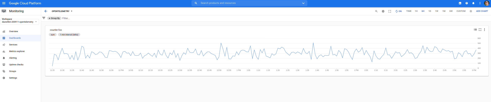

# go-opentelemetry-proves

## Releases

There is a problem with `v0.11.0` and so go.mod contains:

```console
github.com/GoogleCloudPlatform/opentelemetry-operations-go/exporter/metric v0.11.1-0.20200910093037-ef5e24b7fcfc
```

## Run

Requires a Project with Cloud Monitoring enabled and a service account with `roles/monitoring.admin`

So:

```bash
PROJECT="dazwilkin-$(date +%y%m%d)-opentelemetry"
BILLING=$(gcloud alpha billing accounts list --format="value(name)")
ACCOUNT="stackdriver"

gcloud projects create ${PROJECT}
gcloud beta billing projects link ${PROJECT} --billing-account=${BILLING}

gcloud services enable monitoring.googleapis.com --project=${PROJECT}

gcloud iam service-accounts create ${ACCOUNT} \
--project=${PROJECT}

gcloud iam service-accounts keys create ${PWD}/${ACCOUNT}.json  \
--iam-account=${ACCOUNT}@${PROJECT}.iam.gserviceaccount.com \
--project=${PROJECT}

gcloud projects add-iam-policy-binding ${PROJECT} \
--member=serviceAccount:${ACCOUNT}@${PROJECT}.iam.gserviceaccount.com \
--role=roles/monitoring.admin
```

Perhaps then: `https://console.cloud.google.com/monitoring/signup?project=${PROJECT}`

Interestingly, there's a new `gcloud monitoring dashboards create ....`

So:

```bash
gcloud monitoring dashboards create \
--config-from-file=${PWD}/dashboard.json \
--project=${PROJECT}

DASHBOARD=$(gcloud monitoring dashboards list \
--filter="displayName=OpenTelemetry" \
--format="value(name.basename())" \
--project=${PROJECT}) && echo ${DASHBOARD}
```

Then:

`https://console.cloud.google.com/monitoring/dashboards/custom/${DASHBOARD}?project=${PROJECT}`


Finally:

```bash
GOOGLE_APPLICATION_CREDENTIALS=${PWD}/${ACCOUNT}.json \
PROJECT=${PROJECT} \
go run github.com/DazWilkin/go-opentelemetry-prove
```

Yields:

```console
2020/09/11 11:24:51 [main] ProjectID: dazwilkin-200911-opentelemetry
2020/09/11 11:25:01 [main] v=69
2020/09/11 11:25:11 [main] v=12
2020/09/11 11:25:21 [main] v=75
2020/09/11 11:25:31 [main] v=10
2020/09/11 11:25:41 [main] v=38
2020/09/11 11:25:51 [main] v=56
2020/09/11 11:26:01 [main] v=73
2020/09/11 11:26:11 [main] v=68
2020/09/11 11:26:21 [main] v=79
2020/09/11 11:26:31 [main] v=17
```

And:



## APIs Explorer

```bash
curl \
--header "Authorization: Bearer $(gcloud auth print-access-token)" \
--header "Accept: application/json" \
"https://monitoring.googleapis.com/v3/projects/${PROJECT}/metricDescriptors?filter=metric.type%3D%22custom.googleapis.com%2Fopentelemetry%2Fcounter.foo%22"
{
  "metricDescriptors": [
    {
      "name": "projects/dazwilkin-200911-opentelemetry/metricDescriptors/custom.googleapis.com/opentelemetry/counter.foo",
      "labels": [
        {
          "key": "dog"
        },
        {
          "key": "lemons"
        },
        {
          "key": "key"
        }
      ],
      "metricKind": "CUMULATIVE",
      "valueType": "INT64",
      "description": "Auto-created custom metric.",
      "type": "custom.googleapis.com/opentelemetry/counter.foo",
      "monitoredResourceTypes": [
        ...
        "global",
        ...
      ]
    }
  ]
}


And:

```bash
TODAY=$(date +'%Y-%m-%d')
curl \
--header "Authorization: Bearer $(gcloud auth print-access-token)" \
--header "Accept: application/json" \
"https://monitoring.googleapis.com/v3/projects/${PROJECT}/timeSeries?filter=metric.type%3D%22custom.googleapis.com%2Fopentelemetry%2Fcounter.foo%22&interval.endTime=${TODAY}T23%3A59%3A59Z&interval.startTime=${TODAY}T00%3A00%3A00Z"
{
  "timeSeries": [
    {
      "metric": {
        "labels": {
          "lemons": "test",
          "key": "value",
          "dog": "Freddie"
        },
        "type": "custom.googleapis.com/opentelemetry/counter.foo"
      },
      "resource": {
        "type": "global",
        "labels": {
          "project_id": "dazwilkin-200911-opentelemetry"
        }
      },
      "metricKind": "CUMULATIVE",
      "valueType": "INT64",
      "points": [
        {
          "interval": {
            "startTime": "2020-09-11T18:24:51Z",
            "endTime": "2020-09-11T22:01:51Z"
          },
          "value": {
            "int64Value": "64441"
          }
        },
        {
          "interval": {
            "startTime": "2020-09-11T18:24:51Z",
            "endTime": "2020-09-11T22:00:51Z"
          },
          "value": {
            "int64Value": "64180"
          }
        },
        {
          "interval": {
            "startTime": "2020-09-11T18:24:51Z",
            "endTime": "2020-09-11T21:59:51Z"
          },
          "value": {
            "int64Value": "63811"
          }
        },
        {
          "interval": {
            "startTime": "2020-09-11T18:24:51Z",
            "endTime": "2020-09-11T21:58:51Z"
          },
          "value": {
            "int64Value": "63541"
          }
        },
        {
          "interval": {
            "startTime": "2020-09-11T18:24:51Z",
            "endTime": "2020-09-11T21:57:51Z"
          },
          "value": {
            "int64Value": "63311"
          }
        },
```
